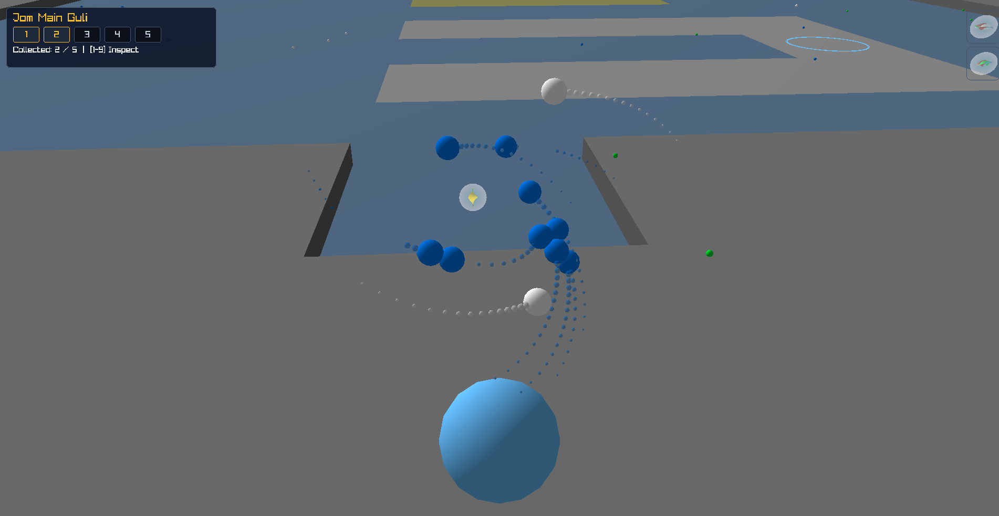
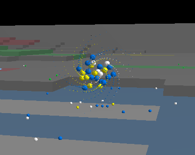
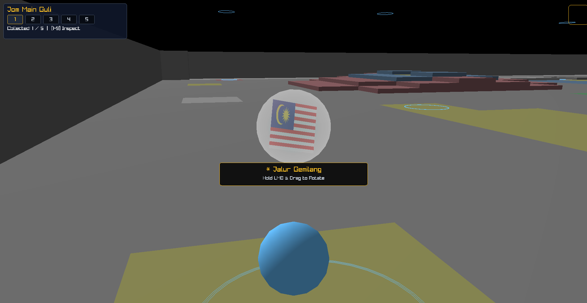
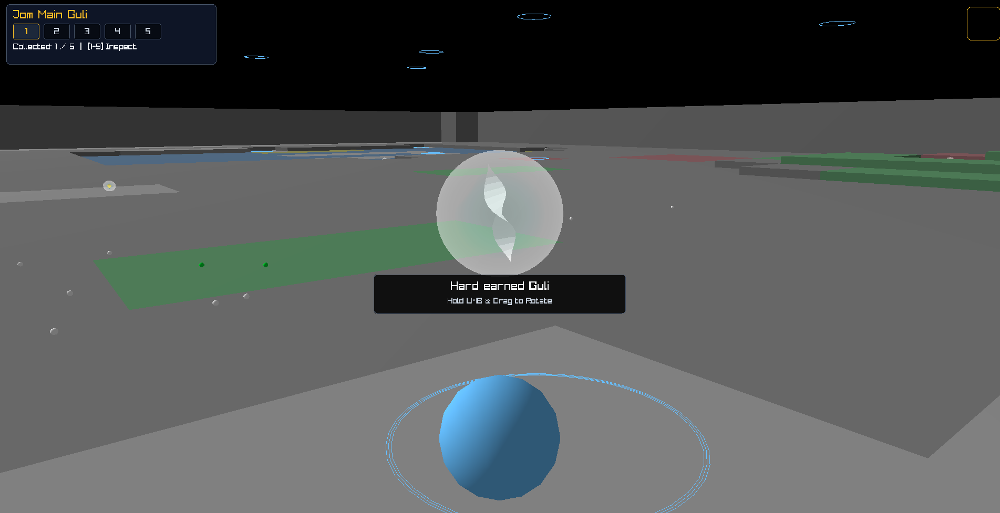

# Jom Main Guli

[](https://en.cppreference.com/)
[](https://www.raylib.com/)
[](https://github.com/skypjack/entt)
[-green)](#how-to-build--run)

> **A 3D physics-driven marble game celebrating Malaysia Day. Channel color energy from the terrain, launch kinetic marble strikes (*pangkah*), and sink marbles into holes to craft iconic Malaysian heritage marbles!**

---

## 30-Second Overview: What is this game?

In traditional Malaysian *Main Guli*, players sit around a circle in the sand, flicking marbles to knock opponents out of the ring.

**Jom Main Guli** takes that childhood nostalgia and supercharges it into an **open-world 3D physics sandbox**:
* You run and jump around a vibrant 3D voxel map.
* You suck elemental color particles right out of the ground.
* You blast those particles into neutral target marbles to steer them over hills, ramps, and obstacles.
* Sinking a marble into a hole triggers a gravitational vortex that sucks in nearby particles and forges a **collectible 3D Malaysian heritage souvenir marble**!

---

## Step-by-Step Gameplay Walkthrough

### Step 1: Explore the Voxel Sandbox
Use **W, A, S, D** and **Space** to run, jump, and parkour across hills, ramps, and platforms. The world is built entirely from colored grid blocks (Red, Blue, Yellow, Green, White).

### Step 2: Suck Up Color Energy
Stand near colored tiles and **Hold Left Mouse Button (LMB)**. You channel raw color energy straight out of the ground into a swirling particle orb floating right in front of your camera.



### Step 3: Pangkah! (Blast Away)
Aim with your mouse and **Release Left Mouse Button (LMB)** to unleash a kinetic blast into neutral target marbles (*Guli Taruhan*). Watch momentum and spin send them rolling down slopes and bouncing off walls!



### Step 4: Sink it in the Goal Hole (*Lubang Induk*)
Knock the marble into any goal hole on the map. The moment it drops in, a gravitational vortex activates and sucks in every loose colored particle nearby.

### Step 5: Cook Heritage Marbles
The hole fuses the swallowed colors into legendary Malaysian heritage marbles with encased 3D emblems:

| Recipe Colors | Forged Souvenir Marble | What's Inside the Glass? |
|:---|:---|:---|
| Red + Blue + Yellow + White | **Jalur Gemilang** | Miniature 3D Malaysian Flag |
| Red + Yellow | **Bunga Raya** | 3D National Hibiscus Flower |
| Green + Red | **Nasi Lemak** | 3D Banana Leaf & Sambal Dish |
| Blue + Yellow / White | **Petronas Twin Towers** | 3D Illuminated KLCC Towers |
| *Any other color mix* | **Procedural Swirl Guli** | Custom double-helix glass ribbon |

### Step 6: Bag & Inspect in 3D
Walk into the newly forged floating marble to bag it!
* Press **1 to 9** on your keyboard to open the **3D Inspection View**.
* **Hold Left Click & Drag** to spin and admire your handcrafted marble and its encased emblem in real time!
* Press **ESC** or **Right Click** to exit inspection and get back to the action.

| Heritage 3D Inspection | Procedural Swirl Inspection |
|:---:|:---:|
|  |  |

---

## Engine & Physics Highlights

* **Continuous Collision Detection (CCD)**: Fast-moving particles use an analytical quadratic sweep solver so they never phase through marbles between frames, no matter how fast they fly.
* **Non-Slip Rolling Physics**: Voxel terrain normals calculate real rolling torque on the fly, so marbles roll naturally down slopes instead of just sliding.
* **Spiral Vortex Suction**: Sinking a marble in a hole creates an inward swirling vortex that pulls loose particles into the center like water down a drain.
* **Dual-Pass Glass Shaders**: Custom GLSL shader with Fresnel rim glow on the outer glass sphere, encasing procedural ribbons or 3D badges inside.
* **Screen-Space 3D UI**: Do you know your inventory is actually rendered in 3D space? We just draw box around it to create illusion it is 2D.
* **Spatialized 3D Acoustics**: 24 unique glass clink audio samples, scaling volume dynamically based on impact speed and camera distance.

---

## What We Built vs. Raylib

We chose **Raylib 5.0** because it is a lightweight, non-intrusive C library that handles raw windowing, OpenGL context creation, input polling, and audio output from our own `main()` without imposing an engine editor or gameplay framework. All architecture, math, and game simulation were built from scratch:

| Component | Provided by Raylib | Custom Built in this Project |
|:---|:---|:---|
| **Architecture** | Windowing & GL Context | ECS systems using EnTT, Event Bus Dispatcher, State Machine |
| **Physics** | Simple distance/box checks | Continuous Collision Detection (CCD), Voxel Heightmap Normals, Non-Slip Rolling Physics, Spiral Vortex Attraction |
| **World & Mesh** | Basic mesh drawing | ASCII `.map` + `.color` parser, Procedural 3D Voxel Mesh Generator with baked colors and step walls |
| **Graphics** | Shader loading boilerplate | Custom Dual-Pass Fresnel Glass Shader, Procedural Parametric Helix Ribbon Generator, 2D-to-3D Image Extruder |
| **Camera & UI** | Raw 3D Camera struct | Smooth Follow Camera with exponential damping, Screen-Space to 3D Raycast Collection Bag Viewer |
| **Audio** | Device output | Spatial 3D Audio Resolver, Normal-Velocity Volume Scaler, 24-sample glass impact selector |

---

## Where Week 1 Shows Up in This Code

* **Const-Correctness**: Const member functions across all query methods (`Map::getTile() const`, `ModelManager::getModel() const`) and const references (`const T&`) for read-only parameters.
* **Ownership & RAII**: Zero raw owning pointers. RAII wrappers manage OpenGL shaders, model buffers (`ModelManager::unloadAll()`), audio buffers (`SoundManager::shutdown()`), and window lifecycle (`Engine::~Engine()`).
* **Class Design & ECS**: Clean separation between pure data structs (`namespace component`) and logic processors (`namespace systems`), with widget polymorphism (`IWidget` $\rightarrow$ `TextButtonWidget`).
* **STL Containers**: `std::vector` for entity pools, `std::map`/`std::unordered_map` for procedural caching and merge grouping, `std::set` for color deduplication, and `std::optional` for fallible queries.
* **Patterns**: **Flyweight** (`ModelManager` procedural model cache), **Observer / Event Bus** (`entt::dispatcher` handling collisions and sounds), and **Factory** (`entity::spawn*`).
* **Algorithms**: Continuous Collision Detection quadratic sweep solver (`calculateCollisionInterval`), inward spiral vortex attraction (`calculateVortexAttractionVelocity`), and inverse-distance spatial color sampling.
* **Tests**: Catch2 test suite with automated test archive (`libcodesfaires.a`) guarding core mechanics.

---

## Controls Cheat Sheet

| Action | Input |
|:---|:---|
| **Move** | `W` `A` `S` `D` |
| **Jump** | `SPACE` |
| **Look / Aim** | Mouse Movement |
| **Move mouse only** | `Alt` + Mouse Movement |
| **Toggle Aim Zoom** | Mouse Scroll Wheel |
| **Look Behind** | Hold `F` |
| **Channel Colors** | Hold **Left Mouse Button (LMB)** |
| **Shoot Particles (*Pangkah*)** | Release **Left Mouse Button (LMB)** |
| **Inspect Crafted Marble** | Press **`1` – `9`** (Bag Slots) |
| **Rotate Inspected Marble** | **Hold LMB + Drag Mouse** |
| **Exit Inspection / Menu** | `ESCAPE` or **Right Mouse Button (RMB)** |
| **Reset Level** | `R` |

---

## How to Build & Run

### Prerequisites
* `g++` (C++17 or C++20 support)
* GNU `make`
* Raylib 5.0 (automatically cloned & built if missing)
* Standard libraries: OpenGL, `libX11`, `libpthread`, `libdl`, `librt`

### Commands

```bash
# 1. Build and launch the game (automatically builds Raylib on first run)
make run

# 2. Build the executable only
make all

# 3. Run automated tests
make test

# 4. Rebuild from scratch
make re
```

---

## Retrospective & Future Ideas

### Jam Scope Cuts:
* Focused on polished kinetic momentum and direct heritage recipes rather than complex crafting trees.
* Chose immediate, athletic real-time LMB channeling over slow slingshot trajectory aiming.
* Skipped all TTD and testing files for fast delivery

### If We Had More Time:
* **Graphics**: Textures, normal mappings on maps, and better Guli glass models.
* **More Heritage Souvenirs**: 3D Wau Bulan kites, Gasing tops, and Harimau motifs.
* **Sloped maps**: Between tile heights, make it a slope so marbles can roll down/up naturally
* **Test suites**: Actually do tdd and add tests

---

<div align="center">
  <b>Selamat Hari Malaysia!</b>
</div>
