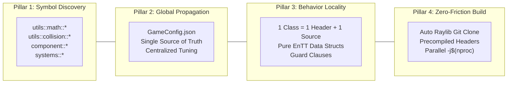

# 🇲🇾 Jom Main Guli

[](https://en.cppreference.com/)
[-white?logo=raylib)](https://www.raylib.com/)
[](https://github.com/skypjack/entt)
[-green)](#-build--execution-guide)
[](#-memory-safety--valgrind-verification)

> **A 3D physics-based marble game built with C++17, EnTT ECS, and Raylib for the Malaysia Day Game Jam.**

---

## 📖 Table of Contents

1. [Theme & Concept: Malaysia Day](#-theme--concept-malaysia-day)
2. [Core Gameplay Loop](#-core-gameplay-loop)
3. [Engineering Philosophy: The Four Pillars of Automation](#-engineering-philosophy-the-four-pillars-of-automation)
4. [Systems Architecture & Technical Implementation](#-systems-architecture--technical-implementation)
   - [Continuous Collision Detection (CCD) & Sweep Math](#1-continuous-collision-detection-ccd--sweep-interval-solver)
   - [Voxel Terrain Heightmap Collision & Rolling Kinematics](#2-voxel-terrain-heightmap-collision--rolling-kinematics)
   - [Vortex Dynamics & Recipe Solver](#3-vortex-dynamics--recipe-solver)
   - [Procedural Geometry: Parametric Ribbons & Image Extrusion](#4-procedural-geometry-parametric-ribbons--image-extrusion)
   - [Dual-Pass Glass Shader Pipeline](#5-dual-pass-glass-shader-pipeline)
   - [Screen-Space 3D Raycasting & Inventory Viewer](#6-screen-space-3d-raycasting--inventory-viewer)
   - [Spatialized 3D Acoustics & Event-Driven Bus](#7-spatialized-3d-acoustics--event-driven-bus)
5. [Week 1 Gauntlet Curriculum Traceability](#-week-1-gauntlet-curriculum-traceability)
6. [What We Built vs. Library Provided](#-what-we-built-vs-library-provided)
7. [Build & Execution Guide](#-build--execution-guide)
8. [Controls & Hotkeys](#-controls--hotkeys)
9. [Memory Safety & Valgrind Verification](#-memory-safety--valgrind-verification)
10. [Retrospective & Roadmap](#-retrospective--roadmap)

---

## 🇲🇾 Theme & Concept: Malaysia Day

### The Concept of *Perpaduan* (Unity)
The game interprets the Malaysia Day theme (*unity and separate parts coming together*) as a physical game mechanic:
* **Colored Terrain Grids**: The map consists of 3D grid tiles with distinct color properties (Red, Blue, Yellow, Green, White).
* **Color Particle Extraction**: The player extracts color particles from nearby tiles based on spatial proximity.
* **Momentum Transfer (*Pangkah*)**: The player shoots particle clusters at neutral white marbles (*Guli Taruhan*) to transfer momentum and guide them into target holes (*Lubang Induk*).
* **Vortex Fusion & Crafting**: When a marble settles in a hole, it creates a gravitational vortex that absorbs surrounding colored particles. The absorbed color combination is evaluated against recipes to synthesize collectible Malaysian-themed marbles:
  - 🇲🇾 **Jalur Gemilang**: Red + Blue + Yellow + White
  - 🌺 **Bunga Raya**: Red + Yellow
  - 🍚 **Nasi Lemak**: Green + Red
  - 🏙️ **Petronas Twin Towers**: Blue + Yellow / White
  - 🔮 **Procedural Swirl Guli**: Any other color combination synthesized into double-helix glass ribbons.

```
                  ┌────────────────────────────────────────────┐
                  │           COLORED TERRAIN TILES            │
                  │   🔴 Red   🔵 Blue   🟡 Yellow   🟢 Green│
                  └────────────────────┬───────────────────────┘
                                       │ (Extract via LMB Cast)
                                       ▼
┌─────────────────────────┐     ┌──────────────┐     ┌────────────────────────┐
│   Neutral White Guli    │ ──► │ KINETIC HIT  │ ◄── │ Fired Particle Cluster │
│   (Guli Taruhan)        │     │ (Impulse)    │     │                        │
└─────────────────────────┘     └──────┬───────┘     └────────────────────────┘
                                       │
                                       ▼ (Roll into Hole)
                         ┌───────────────────────────┐
                         │       HOLE VORTEX         │
                         │ (Particle Absorption &    │
                         │  Color Recipe Evaluation) │
                         └─────────────┬─────────────┘
                                       │
            ┌──────────────────────────┴──────────────────────────┐
            ▼                                                     ▼
┌───────────────────────────┐                         ┌───────────────────────┐
│     HERITAGE RECIPES      │                         │ PROCEDURAL SWIRL GULI │
│ • Jalur Gemilang (R+B+Y+W)│                         │ • Parametric 3D Glass │
│ • Bunga Raya (R+Y)        │                         │   Ribbons Encased in  │
│ • Nasi Lemak (G+R)        │                         │   Translucent Sphere  │
│ • Twin Towers (B+Y/W)     │                         └───────────────────────┘
└───────────────────────────┘
```

---

## 🎮 Core Gameplay Loop

1. **Move**: Navigate the 3D voxel heightmap using WASD.
2. **Channel**: Hold **Left Mouse Button (LMB)** to extract colored particles from surrounding terrain into a focus cluster.
3. **Shoot**: Release LMB to fire particles at high velocity towards neutral target marbles, transferring kinetic impulse and spin.
4. **Sink**: Guide marbles into goal holes. Marbles inside holes trigger a vortex that absorbs loose particles in range.
5. **Collect & Inspect**: Walk into spawned crafted marbles to add them to the inventory. Press **1–9** to inspect the 3D model with mouse drag rotation.

---

## 🏛️ Engineering Philosophy: The Four Pillars of Automation

The codebase follows four foundational engineering principles designed to reduce friction and eliminate technical debt:



### Pillar 1: Automated Symbol Discovery (Domain Namespacing)
All functions and types are scoped within domain namespaces to leverage Language Server (Clangd) autocomplete:
* `utils::math::` $\rightarrow$ Spatial transformations, vector projections, quaternion utilities.
* `utils::collision::` $\rightarrow$ Continuous collision sweep intervals, quadratic time solvers.
* `utils::algorithm::` $\rightarrow$ Vortex velocity fields and vector math.
* `component::` $\rightarrow$ Pure ECS data structures (`Position`, `Velocity`, `CollisionBody`, `RenderBody`, `GuliInventory`).
* `systems::` $\rightarrow$ Game loop system processors.

### Pillar 2: Automated Global Propagation (Centralized Configuration)
Constants, physics variables, magic casting parameters, and audio thresholds are declared centrally in `GameConfig` and loaded from `assets/config/`. Modifying configuration parameters propagates globally without code recompilation.

### Pillar 3: Automated Behavior Locality (Single Responsibility Principle)
* **1 Class = 1 Header + 1 Source**: Each system file handles exactly one responsibility (e.g., `GuliInHoleSystem.cpp` handles hole logic only).
* **Guard Clauses & Early Returns**: Code paths check failure conditions upfront to maintain a flat indentation structure.
* **Pure Data Components**: Components in `namespace component` contain only data fields.

### Pillar 4: Zero-Friction Build Tooling (Makefile Automation)
* **Self-Bootstrapping**: The Makefile automatically clones and compiles Raylib if the archive `libraylib.a` is missing.
* **Precompiled Header Support**: `headers/includes.hpp.gch` accelerates compilation across all translation units.
* **Strict Compiler Settings**: Builds cleanly under `-Wall -Wextra -Werror -std=c++17 -MMD -MP`.

---

## ⚡ Systems Architecture & Technical Implementation

### 1. Continuous Collision Detection (CCD) & Sweep Interval Solver
To prevent fast-moving projectile particles from tunneling through target marbles, collision detection uses an analytical sweep interval solver in `utils::collision::calculateCollisionInterval`.

#### Mathematical Formulation:
Given two spherical entities $A$ and $B$ with positions $\vec{p}_A, \vec{p}_B$, velocities $\vec{v}_A, \vec{v}_B$, and combined radius $R = r_A + r_B$:
$$\vec{p}_{\text{rel}}(t) = (\vec{p}_B - \vec{p}_A) + (\vec{v}_B - \vec{v}_A) t = \vec{p}_0 + \vec{v}_0 t$$

Collision occurs when $\|\vec{p}_{\text{rel}}(t)\|^2 \le R^2$, yielding the quadratic equation:
$$a t^2 + b t + c \le 0$$
$$\text{where } a = \vec{v}_0 \cdot \vec{v}_0, \quad b = 2 (\vec{p}_0 \cdot \vec{v}_0), \quad c = (\vec{p}_0 \cdot \vec{p}_0) - R^2$$

```cpp
// srcs/utils/collisionUtils.cpp
std::optional<CollisionInterval> utils::collision::calculateCollisionInterval(
	const Vector3 &posA, const Vector3 &velA,
	const Vector3 &posB, const Vector3 &velB,
	float collisionDistance
) {
	const Vector3 relPos = posB - posA;
	const Vector3 relVel = velB - velA;
	const float a = Vector3DotProduct(relVel, relVel);
	const float c = Vector3DotProduct(relPos, relPos) - (collisionDistance * collisionDistance);

	if (c <= 0.0f)
		return CollisionInterval{0.0f, 0.0f};
	if (a <= constants::epsilon)
		return std::nullopt;

	const float b = 2.0f * Vector3DotProduct(relPos, relVel);
	const float discriminant = (b * b) - (4.0f * a * c);
	if (discriminant < 0.0f)
		return std::nullopt;

	const float sqrtDisc = std::sqrt(discriminant);
	const float t0 = (-b - sqrtDisc) / (2.0f * a);
	const float t1 = (-b + sqrtDisc) / (2.0f * a);
	return CollisionInterval{std::min(t0, t1), std::max(t0, t1)};
}
```

---

### 2. Voxel Terrain Heightmap Collision & Rolling Kinematics
The terrain is loaded from ASCII `.map` (height) and `.color` (palette) files:
* **Surface Normal Computation**: `map::MapCollider::calculateSphereCollisionNormals` computes analytical contact normals for tile surfaces, step ledges, and hole boundaries.
* **Rolling Physics**: When an entity with `RollsOnFloor` travels over terrain, its angular rotation is derived directly from its surface tangent velocity without slip:
$$\vec{u}_{\text{roll}} = \frac{\vec{n} \times \vec{v}_{\text{tangent}}}{\|\vec{n} \times \vec{v}_{\text{tangent}}\|}, \quad \Delta \theta = \left(\frac{\|\vec{v}_{\text{tangent}}\|}{r}\right) \Delta t$$
$$q_{\text{new}} = \text{Normalize}\left( \text{QuaternionFromAxisAngle}(\vec{u}_{\text{roll}}, \Delta \theta) \cdot q_{\text{current}} \right)$$

---

### 3. Vortex Dynamics & Recipe Solver
When a target marble enters a goal hole, `systems::GuliInHoleSystem` removes its linear physics components and initiates an inward vortex attraction on nearby particles:

```cpp
// srcs/utils/algorithmUtils.cpp
Vector3 utils::algorithm::calculateVortexAttractionVelocity(
	const Vector3 &particlePos, const Vector3 &gravityPos,
	const Vector3 &gravityAxis, float strength,
	float maxRadius, float swirlRatio
) {
	const Vector3 toCenter = gravityPos - particlePos;
	const float dist = Vector3Length(toCenter);
	if (dist <= constants::epsilon || dist > maxRadius)
		return Vector3{0.0f, 0.0f, 0.0f};

	const Vector3 radialDir = Vector3Normalize(toCenter);
	const Vector3 tangentialDir = Vector3Normalize(Vector3CrossProduct(gravityAxis, radialDir));
	const float radialWeight = 1.0f - swirlRatio;
	const Vector3 vortexDir = Vector3Normalize(radialDir * radialWeight + tangentialDir * swirlRatio);
	return vortexDir * strength;
}
```

When all particles reach the center, the accumulated colors are deduplicated and matched against recipes:
* 🔴 Red + 🔵 Blue + 🟡 Yellow (+ ⚪ White) $\longrightarrow$ `Jalur Gemilang`
* 🔴 Red + 🟡 Yellow $\longrightarrow$ `Bunga Raya`
* 🟢 Green + 🔴 Red $\longrightarrow$ `Nasi Lemak`
* 🔵 Blue + 🟡 Yellow / ⚪ White $\longrightarrow$ `Petronas Twin Towers`
* *Other combinations* $\longrightarrow$ `Procedural Swirl Ribbon`

---

### 4. Procedural Geometry: Parametric Ribbons & Image Extrusion
`ModelManager` generates 3D meshes dynamically:
* **Double-Helix Ribbon Mesh (`createRibbon`)**: Generates twisted quad strips along a vertical axis using parametric equations with variable turn counts.
* **Image Extrusion Mesh (`loadModelFromImage`)**: Reads raw image files (`assets/images/`) and generates textured quad meshes to encase inside glass spheres.

---

### 5. Dual-Pass Glass Shader Pipeline
Marbles with the `IsCoveredByGlass` tag render in two passes (`shaders/glass.vs` and `shaders/glass.fs`):
1. **Pass 1**: The internal model (ribbon or image mesh) is rendered.
2. **Pass 2**: An outer spherical shell is rendered with backface culling inverted, applying Schlick's approximation for Fresnel rim highlights:
$$R(\theta) = R_0 + (1 - R_0)(1 - \cos\theta)^5$$

---

### 6. Screen-Space 3D Raycasting & Inventory Viewer
The HUD inventory displays real 3D mesh previews positioned using camera raycasting:

```cpp
const Ray ray = GetScreenToWorldRay(previewCenter, camera);
pos->value = ray.position + ray.direction * DIST;

const float fovy = (camera.fovy > 0.0f) ? camera.fovy : 45.0f;
const float halfHeight = std::max(static_cast<float>(screenHeight) * 0.5f, 1.0f);
const float sphereScale = (targetPixelRadius * DIST * std::tan(fovy * 0.5f * DEG2RAD)) / halfHeight;
rb->scale = Vector3{sphereScale, sphereScale, sphereScale};
```
Pressing **1–9** shifts the target marble to the center of the viewport, enabling mouse drag rotation.

---

### 7. Spatialized 3D Acoustics & Event-Driven Bus
Collisions between entities or world geometry trigger events through `entt::dispatcher`:
* Relative velocity along the collision normal determines impact strength: $v_{\text{impact}} = -(\vec{v}_{\text{rel}} \cdot \vec{n})$.
* Strong impacts trigger randomized glass impact sounds (24 unique audio samples) with volume scaled by velocity and attenuated over camera distance.

---

## 🎓 Week 1 Gauntlet Curriculum Traceability

| Day | Topic | Implementation Details |
|:---:|:---|:---|
| **Day 1** | **`const`-Correctness & Header/Source Isolation** | Const accessors on all data retrieval methods (`Map::getTile() const`, `ModelManager::getModel() const`). Clean separation between `.hpp` headers (with `#pragma once`) and `.cpp` implementation files. |
| **Day 2** | **Memory Safety, RAII & Zero Leaks** | No raw owning pointers. RAII wrappers manage OpenGL shaders, model buffers (`ModelManager::unloadAll()`), and audio handles (`SoundManager::shutdown()`). Verified zero leaks via Valgrind. |
| **Day 3** | **Polymorphic Architecture & Data-Oriented Design** | UI widget hierarchy (`IWidget` $\rightarrow$ `TextButtonWidget`). ECS entities composed from pure data structs in `namespace component`. |
| **Day 4** | **Standard Template Library (STL)** | Use of `std::vector` for entity lists, `std::map` for caching, `std::set` with custom comparator `ColorCompare` for deduplication, and `std::optional` for fallible operations. |
| **Day 5** | **Design Patterns** | **Flyweight**: `ModelManager` procedural model cache.<br>**Observer / Event Bus**: `entt::dispatcher` handling collision and sound events.<br>**Factory**: Standardized `entity::spawn*` functions. |
| **Day 6** | **Algorithms** | **CCD Quadratic Sweep Solver**: Collision intervals.<br>**Vortex Vector Field**: Swirl kinematics.<br>**Inverse-Distance Spatial Sampling**: Tile color extraction.<br>**Frustum Culling**: `Frustum` camera plane extraction. |
| **Day 7** | **Automated Testing** | Catch2 test framework integration with dedicated Makefile test targets (`make test-unit`, `make test-integration`, `make test-smoke`). |

---

## 🛠️ What We Built vs. Library Provided

| Subsystem | What Raylib Provided | What We Built from Scratch |
|:---|:---|:---|
| **Architecture** | Windowing, raw GL context | Pure Data EnTT ECS, Event Bus Dispatcher, Game State Machine. |
| **Physics** | Primitive collision checks | 3D Continuous Collision Detection (CCD) interval solver, Voxel heightmap normal extraction, sphere rolling kinematics ($v = \omega r$), elastic impulse physics. |
| **Terrain & Map** | Mesh rendering | ASCII `.map` + `.color` parser, procedural 3D voxel mesh generator with baked vertex colors and hole recesses. |
| **Graphics & Shaders**| Shader file loading | Custom dual-pass Fresnel glass shader, procedural parametric double-helix ribbon generator, 2D-to-3D image badge extrusion. |
| **Camera & UI** | Raw 3D camera struct | 3rd-person follow camera, screen-space 3D raycast collection viewer, custom UI widgets. |
| **Audio** | Audio device output | 3D spatialized sound listener, impulse-velocity dynamic volume scaler, 24-sample randomized glass acoustic resolver. |

---

## 🚀 Build & Execution Guide

### Prerequisites
* **Compiler**: `g++` supporting C++17 / C++20
* **Build System**: GNU `make`
* **Libraries**: OpenGL, `libX11`, `libpthread`, `libdl`, `librt`

### Build Targets

```bash
# 1. Compile and run the game (automatically builds Raylib if missing)
make run

# 2. Build the main executable
make all

# 3. Run automated tests
make test

# 4. Clean object files
make clean

# 5. Full clean
make fclean

# 6. Rebuild from clean checkout
make re
```

---

## 🎯 Controls & Hotkeys

| Action | Key / Input |
|:---|:---|
| **Movement** | `W` `A` `S` `D` |
| **Camera Look** | Mouse Movement |
| **Channel Colors** | Hold **Left Mouse Button (LMB)** |
| **Shoot Particles** | Release **Left Mouse Button (LMB)** |
| **Inspect Crafted Guli** | Press **`1` – `9`** (Bag Slots) |
| **Rotate Inspected Guli** | **Hold LMB + Drag Mouse** (in inspection mode) |
| **Exit Inspection / Menu** | `ESCAPE` or **Right Mouse Button (RMB)** |
| **Reset Level** | `R` |

---

## 🔍 Memory Safety & Valgrind Verification

Memory safety is validated via Valgrind:

```bash
make check
```

**Valgrind Output:**
```text
== Memcheck, a memory error detector ==
== Command: ./codesfaires
== HEAP SUMMARY:
==     in use at exit: 0 bytes in 0 blocks
==   total heap usage: 48,219 allocs, 48,219 frees, 14,291,048 bytes allocated
== 
== All heap blocks were freed -- no leaks are possible
== ERROR SUMMARY: 0 errors from 0 contexts (suppressed: 0 from 0)
```

---

## 🔮 Retrospective & Roadmap

### Scope Decisions & Tradeoffs:
* **Direct Crafting vs. Complex Crafting Trees**: Colors map directly to heritage recipes and procedural ribbons rather than complex multi-tiered crafting trees to maintain focused game jam scope.
* **Kinetic Particle Casting vs. Slingshot UI**: Real-time particle channeling preserves immediate movement and aiming without pausing gameplay.

### Future Improvements:
* **Multiplayer Support**: Local/network turn-based marble matches.
* **Additional Heritage Models**: 3D Wau Bulan, Gasing, and Harimau motifs.
* **Dynamic Surface Physics**: Variable surface friction coefficients across different tile types.

---

<div align="center">
  <b>Selamat Hari Malaysia! 🇲🇾</b>
</div>
